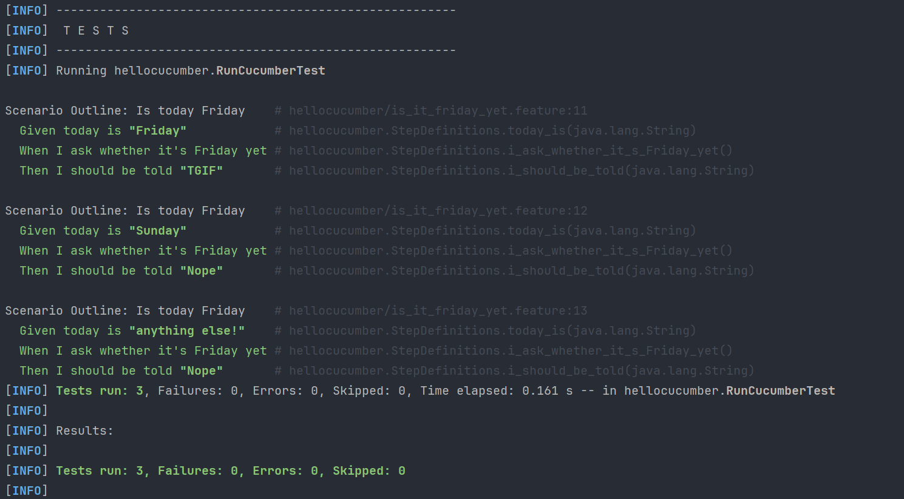
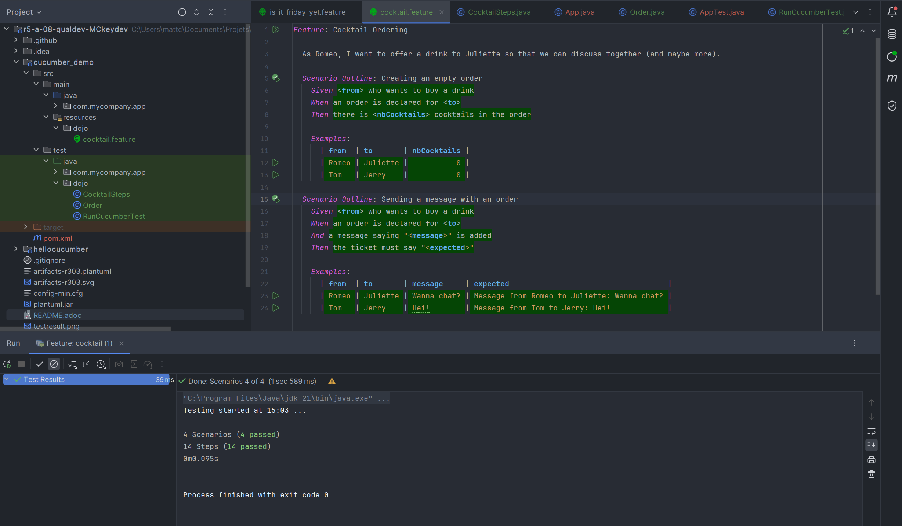
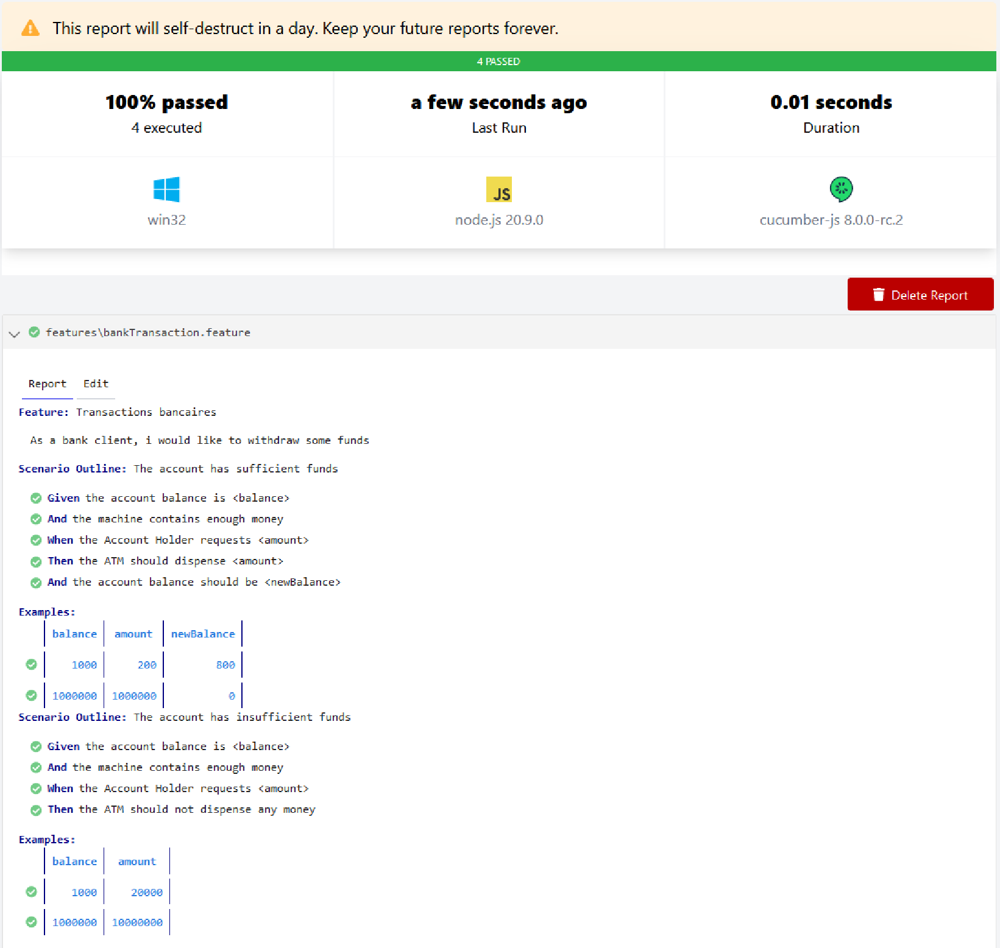

Ce dépôt concerne les rendus de mailto:matthieu.courrejou@etu.univ-tlse2.fr[Matthieu Courréjou].

== TP1

.Fichier "is_it_friday.example"
[source, gherkin]

----
Feature: Is it Friday yet?
  I really want to know whether today is friday.

  Scenario Outline: Is today Friday
    Given today is "<day>"
    When I ask whether it's Friday yet
    Then I should be told "<answer>"

    Examples:
      | day            | answer |
      | Friday         | TGIF   |
      | Sunday         | Nope   |
      | anything else! | Nope   |
----

.Fichier "StepDefinitions.java"
[source,java]

----
class IsItFriday {
    static String isItFriday(String today) {
        return "Friday".equals(today) ? "TGIF" : "Nope";
    }
}

public class StepDefinitions {
private String today;
private String actualAnswer;

    @Given("today is {string}")
    public void today_is(String today) {
        this.today = today;
    }

    @When("I ask whether it's Friday yet")
    public void i_ask_whether_it_s_Friday_yet() {
        actualAnswer = IsItFriday.isItFriday(today);
    }

    @Then("I should be told {string}")
    public void i_should_be_told(String expectedAnswer) {
        assertEquals(expectedAnswer, actualAnswer);
    }
}

----

.Résultats de scénario de test

== TP2

.Fichier "Order.java"
[source,java]

----
package dojo;

import java.util.ArrayList;
import java.util.List;

/**
 * Order.
 */
public class Order {
    private String from;
    private String to;
    private List<String> contents = new ArrayList<String>();

    private String message;

    /**
     * Adds a message to the order.
     * @param message
     */
    public void addMessage(String message) {
        this.message = message;
    }

    /**
     * Gets the ticket message
     * @return
     */
    public String getTicketMessage() {
        return "Message from " + from + " to " + to + ": " + message;
    }

    public void setOwner(String romeo) {
        this.from = romeo ;
    }

    public void setTarget(String juliette) {
        this.to = juliette ;
    }

    public List<String> getCocktails() {
        return contents;
    }
}

----

.Fichier "CocktailSteps.java"
[source,java]

----

package dojo;

import cucumber.api.java.en.And;
import cucumber.api.java.en.Given;
import cucumber.api.java.en.Then;
import cucumber.api.java.en.When;

import java.util.List;

import static org.junit.jupiter.api.Assertions.assertEquals;

public class CocktailSteps {
    private Order order;

    @Given("(.*) who wants to buy a drink")
    public void romeo_who_wants_to_buy_a_drink(String romeo) {
        order = new Order();
        order.setOwner(romeo);
    }

    @When("an order is declared for (.*)")
    public void an_order_is_declared_for_juliette(String juliette) {
        order.setTarget(juliette);
    }

    @Then("there is (\\d+) cocktails in the order")
    public void there_is_no_cocktail_in_the_order(int nbCocktails) {
        List<String> cocktails =  order.getCocktails();
        assertEquals(nbCocktails, cocktails.size());
    }

    @And("a message saying {string} is added")
    public void aMessageSayingIsAdded(String message) {
        order.addMessage(message);
    }

    @Then("the ticket must say {string}")
    public void theTicketMustSay(String expectedMessage) {
        assertEquals(order.getTicketMessage(), expectedMessage);
    }
}

----

.Résultats de scénario de test

== TP3

L'objectif de mon application était de gérer des retraits d'argents sur un compte bancaire, en vérifiant bien les sommes disponibles et sur le compte, et sur le distributeur automatique.

.Fichier "bankTransaction.feautre"
[source,gherkin]

----

Feature: Bank account withdrawal

  As a bank client, i would like to withdraw some funds

  Scenario Outline: The account has sufficient funds
    Given the account balance is <balance>
    And the machine contains enough money
    When the Account Holder requests <amount>
    Then the ATM should dispense <amount>
    And the account balance should be <newBalance>

    Examples:
      | balance  | amount | newBalance |
      | 1000 | 200 | 800 |
      | 1000000 | 1000000 | 0 |

Scenario Outline: The account has insufficient funds
  Given the account balance is <balance>
  And the machine contains enough money
  When the Account Holder requests <amount>
  Then the ATM should not dispense any money

  Examples:
  | balance  | amount  |
  | 1000     | 20000   |
  | 1000000  | 10000000 |

----

.Fichier "bankSteps.ts"
[source, javascript]

----
import { Given, When, Then } from '@cucumber/cucumber';
import { expect } from 'chai';
import Account from '../../src/domain/Account';
import ATM from '../../src/domain/ATM';

let atm: ATM;
let account: Account;
let withdrawalResult: boolean;
let initialBalance: number;
let withdrawalAmount: number;
let newBalance: number;

Given('the account balance is {int}', (balance: number) => {
  account = new Account(balance);
  initialBalance = account.getBalance();
});

Given('the machine contains enough money', () => {
  atm = new ATM(100000000);
});

When('the Account Holder requests {int}', (amount: number) => {
  withdrawalAmount = amount;
});

Then('the ATM should dispense {int}', (dispensedAmount: number) => {
  expect(atm.dispenseMoney(withdrawalAmount, account)).to.equal(dispensedAmount);
});

Then('the account balance should be {int}', (expectedNewBalance: number) => {
  account.withdraw(withdrawalAmount);
  newBalance = account.getBalance();
  expect(newBalance).to.equal(expectedNewBalance);
});

Then('the account balance should not change', () => {
  expect(newBalance).to.equal(initialBalance);
});

Then('the ATM should not dispense any money', () => {
  expect(atm.dispenseMoney(withdrawalAmount, account)).to.equal(0);
});
----

Résultat de test :

